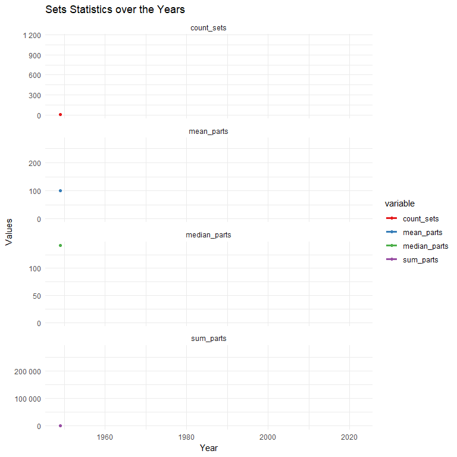

In this report, we will analyse data about LEGO. All data comes from https://rebrickable.com/downloads/, which is a site that allows users to share their MOCs (My Own Creation - constructions created by LEGO fans).

We'll start by looking at the data schema, the tables, and the data they contain. We will see how the tables interconnect and understand what the values of the different attributes are. We will also learn about the size of the entire dataset. The next step will be an analysis of the data from individual or linked tables. We will start with minifigures, then move on to parts and finish the analysis on sets. During the analysis, we will wrestle with missing data. Last but not least, we will try to predict the future using forecasting. There we will focus on all sets and a Star Wars set.

After the analysis, the most striking observation is that LEGO is growing all the time. Every year, there are more sets, and the number of parts increases. Some interesting insights can be reached by observing the data on themes. Many of them are well-known brands (Ben 10, Avatar, Angry Bird) that appear at the peak of the brand hype. In addition to this, there are many generic themes (Town, City) that have been with LEGO for a long time and are becoming more popular every year. It's also worth noting that at the beginning, LEGO didn't cooperate with many external brands, which is why we don't see many sets of external brands at the beginning of the company's operation.

Most of the plots are interactive, so keep in mind that if you want to find out more about the presented data, just hover over it.


```{r setup, include=FALSE}
knitr::opts_chunk$set(
  echo = FALSE,
  warning = FALSE,
  message = FALSE,
  fig.width = 8,
  fig.height = 8
)
```
# Libraries
```{r, echo=TRUE}
library(ggplot2)
library(dplyr)
library(png)
library(grid)
library(plotly)
library(gganimate)
library(tidyr)
library(forecast)
```

# Load data
```{r, cache=TRUE, echo=FALSE}
load_csv <- function(csv_name, data_folder = 'data') {
  df <- read.csv(file.path(data_folder, csv_name))
  df
}

inventories_df <- load_csv('inventories.csv')
inventory_sets_df <- load_csv('inventory_sets.csv')
sets_df <- load_csv('sets.csv')
themes_df <- load_csv('themes.csv')
inventory_minifigs_df <- load_csv('inventory_minifigs.csv')
minifigs_df <- load_csv('minifigs.csv')
inventory_parts_df <- load_csv('inventory_parts.csv')
colors_df <- load_csv('colors.csv')
parts_df <- load_csv('parts.csv')
elements_df <- load_csv('elements.csv')
part_categories_df <- load_csv('part_categories.csv')
part_relationships_df <- load_csv('part_relationships.csv')
```

```{r}
dataframes_list <- list(
  inventories = inventories_df,
  inventory_sets = inventory_sets_df,
  sets = sets_df,
  themes = themes_df,
  inventory_minifigs = inventory_minifigs_df,
  minifigs = minifigs_df,
  inventory_parts = inventory_parts_df,
  colors = colors_df,
  parts = parts_df,
  elements = elements_df,
  part_categories = part_categories_df,
  part_relationships = part_relationships_df
)

dataframes_names <- names(dataframes_list)
```

# Basic tables analysis
## Data schema
We can clearly see that the data is divided into three parts. Going from left to right, the first concerns parts and their color, the second concerns minifigures, and the last one is about sets. All parts have a table with the prefix inventory (for example inventory_sets) which contains stock data. It is possible to connect data through inventories table.
```{r, fig.height = 6}
image_path <- "data/rebrickable_schema_v3.png"
rebrickable_schema <- readPNG(image_path)

image_plot <- ggplot() +
  annotation_custom(
    rasterGrob(
      rebrickable_schema, 
      interpolate = TRUE
    ), 
    xmin = -Inf, 
    xmax = Inf, 
    ymin = -Inf, 
    ymax = Inf) +
  theme_void()

image_plot
```

## Tables

### Inventories
Table linking parts, minifigures and sets.
<ul>
    <li><strong>id:</strong> inventory id</li>
    <li><strong>version:</strong> inventory version</li>
    <li><strong>set_num:</strong> set id</li>
</ul>
```{r}
knitr::kable((head(inventories_df)))
```
```{r}
knitr::kable(summary(inventories_df))
```

### Inventory sets
Sets stock
<ul>
    <li><strong>inventory_id:</strong> inventory id</li>
    <li><strong>set_num:</strong> set id</li>
    <li><strong>quantity:</strong> number of sets</li>
</ul>
```{r}
  knitr::kable((head(inventory_sets_df)))
```
```{r}
knitr::kable(summary(inventories_df))
```

### Sets
Data related to sets
<ul>
    <li><strong>set_num:</strong> set id</li>
    <li><strong>name:</strong> set name</li>
    <li><strong>year:</strong> when set was released</li>
    <li><strong>theme_id:</strong> theme id</li>
    <li><strong>num_parts:</strong> number of parts in set</li>
</ul>
```{r}
  knitr::kable((head(sets_df)))
```
```{r}
knitr::kable(summary(sets_df))
```

### Themes
Data related to themes
<ul>
    <li><strong>id:</strong> theme id</li>
    <li><strong>name:</strong> theme name</li>
    <li><strong>parent_id:</strong> theme id of a parent theme (self-referential foreign key)</li>
</ul>
```{r}
  knitr::kable((head(themes_df)))
```
```{r}
knitr::kable(summary(themes_df))
```

### Inventory Minifigs
Minifigures stock
<ul>
    <li><strong>inventory_id:</strong> inventory id</li>
    <li><strong>fig_num:</strong> minifigures id</li>
    <li><strong>quantity:</strong> number of minifigures</li>
</ul>
```{r}
knitr::kable((head(inventory_minifigs_df)))
```
```{r}
knitr::kable(summary(inventory_minifigs_df))
```

### Minifigs
Data related to minifigures
<ul>
    <li><strong>fig_num:</strong> minifigures id</li>
    <li><strong>name:</strong> minifigure name</li>
    <li><strong>num_parts:</strong> number of parts in minifigure</li>
</ul>
```{r}
knitr::kable((head(minifigs_df)))
```
```{r}
knitr::kable(summary(minifigs_df))
```

### Inventory parts
Parts stock
<ul>
    <li><strong>inventory_id:</strong> inventory id</li>
    <li><strong>part_num:</strong> part id</li>
    <li><strong>color_id:</strong> color id</li>
    <li><strong>quantity:</strong> number of parts</li>
    <li><strong>is_spare:</strong> is part a spare part</li>
</ul>
```{r}
knitr::kable((head(inventory_parts_df)))
```
```{r}
knitr::kable(summary(inventory_parts_df))
```

### Colors
Data related to elements color
<ul>
    <li><strong>id:</strong> color id</li>
    <li><strong>name:</strong> color name</li>
    <li><strong>rgb:</strong> color in rgb format</li>
    <li><strong>is_trans:</strong> is color a transparent color</li>
</ul>
```{r}
knitr::kable((head(colors_df)))
```
```{r}
knitr::kable(summary(colors_df))
```

### Parts
Data related to parts
<ul>
    <li><strong>part_num:</strong> part id</li>
    <li><strong>name:</strong> part name</li>
    <li><strong>part_cat_id:</strong> part category id</li>
</ul>
```{r}
knitr::kable((head(parts_df)))
```
```{r}
knitr::kable(summary(parts_df))
```

### Elements
Data related to part elements
<ul>
    <li><strong>element_id:</strong> element id</li>
    <li><strong>part_num:</strong> part id</li>
    <li><strong>color_id:</strong> color id</li>
</ul>
```{r}
knitr::kable((head(elements_df)))
```
```{r}
knitr::kable(summary(elements_df))
```

### Part Relationships
Data related to parts relationship
<ul>
    <li><strong>rel_type:</strong> type of relationship (rel_types are: (P)rint, Pai(R), Su(B)-Part, (M)old, Pa(T)tern, (A)lternate)</li>
    <li><strong>child_part_num:</strong> id of child part (foreign key to parts)</li>
    <li><strong>parent_part_num:</strong> id of parent part (foreign key to parts)</li>
</ul>
```{r}
knitr::kable((head(part_relationships_df)))
```
```{r}
knitr::kable(summary(part_relationships_df))
```

### Part categories
Data related to parts category
<ul>
    <li><strong>id:</strong> category id</li>
    <li><strong>name:</strong> category name</li>
</ul>
```{r}
knitr::kable((head(part_categories_df)))
```
```{r}
knitr::kable(summary(part_categories_df))
```

## Dataframes size
```{r, comment=NA}
  count_all_rows <- 0
  count_all_columns <- 0
  count_all_values <- 0
  
  for (df in dataframes_list) {
    dimensions <- dim(df)
      
    count_all_rows <- count_all_rows + dimensions[1]
    count_all_columns <- count_all_columns + dimensions[2]
    count_all_values <- count_all_values + (dimensions[1] * dimensions[2])
  }
```

<ul>
    <li><strong>All rows in dataframes:</strong> `r format(count_all_rows, scientific = FALSE)`</li>
    <li><strong>All columns in dataframes</strong> `r format(count_all_columns, scientific = FALSE)` </li>
    <li><strong>All values in dataframes:</strong> `r format(count_all_values, scientific = FALSE)` </li>
</ul>

# Analyses
## Minifigures
```{r}
is_na_figures <- sum(is.na(minifigs_df))
```
##### Sum of rows with NA value: `r is_na_figures[1]`

```{r}
inventory_minifigures <- left_join(inventory_minifigs_df, minifigs_df, by = join_by(fig_num == fig_num))

top_stock_minfigures <- inventory_minifigures %>% 
  select(-inventory_id, -num_parts) %>%
  group_by(fig_num) %>%
  summarise(
    quantity = sum(quantity),
    name = first(name),
    img_url = first(img_url)
  ) %>%
  top_n(10, wt=(quantity)) %>%
  arrange(desc(quantity))
```
#### Largest stock of minifigures
```{r}
top_stock_minfigures %>%
  select(name, img_url, quantity) %>%
  mutate(img_tag = paste0('{width=30%}')) %>%
  select(-img_url) %>%
  knitr::kable(format = "html", align = "ccc")
```

## Parts
```{r}
is_na_parts <- sum(is.na(parts_df))
```
##### Sum of rows with NA value: `r is_na_parts[1]`

#### Material Type of Lego Parts
<strong>Log10(Number of Parts)</strong> is used instead of just displaying Number of Parts because the difference between <strong>Plastic</strong> and other materials is so big that they would be almost invisible on the plot.
```{r}
parts_df_material_grouped <- parts_df %>%
  group_by(part_material) %>%
  summarise(
    count = n()
  )

ggplotly(
  ggplot(
    parts_df_material_grouped, 
    aes(x = reorder(part_material, count), 
        y = count, 
        text = paste("Material: ", part_material, "<br>Count: ",  count)
      )
    ) +
  geom_bar(stat = "identity", fill = "#619cff") +
  coord_flip() +
  labs(title = "Material type of Lego parts (log10)",
       x = "Material",
       y = "log10(Number of parts)") +
  theme_bw() +
  scale_y_log10(), 
  tooltip = "text")
  
```
## Part categories
```{r}
is_na_part_categories <- sum(is.na(part_categories_df))
```
##### Sum of rows with NA value: `r is_na_part_categories[1]`

### Parts with categories
```{r}
parts_with_categories <- left_join(parts_df, part_categories_df, by = join_by(part_cat_id == id), suffix = c("_parts", "_categories"))
parts_with_categories <- select(parts_with_categories, -name_parts)
```

```{r}
is_na_parts_with_categories <- sum(is.na(parts_with_categories))
```
##### Sum of rows with NA value: `r is_na_parts_with_categories[1]`

Part of the table with parts and categories 
```{r}
knitr::kable(head(parts_with_categories)) 
```

We can see that there are 8 main categories (Tiles Round and Curved - Tubes and Hoses)
```{r}
parts_with_categories_grouped_categories <- parts_with_categories %>%
  group_by(name_categories) %>%
  summarise(
    count = n() 
  ) %>%
  top_n(10, wt = name_categories)

ggplotly(
  ggplot(
    parts_with_categories_grouped_categories, 
    aes(x = reorder(name_categories, count), 
        y = count, 
        text = paste("Category: ", name_categories, "<br>Count: ",  count)
      )
    ) +
  geom_bar(stat = "identity", fill = "#619cff") +
  coord_flip() +
  labs(title = "Top 10 categories of Lego parts",
       x = "Category",
       y = "Number of parts") +
  theme_bw(), 
  tooltip = "text")
```
## Elements
```{r}
is_na_elements <- sum(is.na(elements_df))
```
##### Sum of rows with NA value: `r is_na_elements[1]`

##### All NA values are in design_id column
```{r}
na_elements_where <- elements_df %>% 
  summarise(across(everything(), ~ sum(is.na(.))))

knitr::kable(na_elements_where)
```

In the data schema, there is no indication of what the design_id is or where it is located, so we will remove the column from the dataframe
```{r}
elements_df <- select(elements_df, -design_id)
```

### Parts + Categories with Elements
```{r}
parts_with_categories_and_elements <- left_join(parts_with_categories, elements_df, by = join_by(part_num == part_num))
```

```{r}
is_na_parts_categories_elements <- sum(is.na(parts_with_categories_and_elements))
```
##### Sum of rows with NA value: `r is_na_parts_categories_elements[1]`

##### 18850 NA values are in element_id and color_id columns. This means that there are some parts that do not consist of elements
```{r}
na_parts_categories_elements_where <- parts_with_categories_and_elements %>% 
  summarise(across(everything(), ~ sum(is.na(.))))

knitr::kable(na_parts_categories_elements_where)
```

Part of the table with parts + categories with elements 
```{r}
knitr::kable(head(parts_with_categories_and_elements)) 
```

```{r}
has_na <- !complete.cases(parts_with_categories_and_elements)
parts_without_elements <- parts_with_categories_and_elements[has_na, ]
parts_without_elements <- select(parts_without_elements, -element_id, -color_id)
```

```{r}
parts_with_elements <- parts_with_categories_and_elements[!has_na, ]
parts_with_elements <- select(parts_with_elements, -element_id)
```

```{r}
count_parts_with_without_elements <- data.frame(
  category = c("with_elements", "without_elements"),
  count = c(nrow(parts_with_elements), nrow(parts_without_elements))
)

ggplotly(
  ggplot(count_parts_with_without_elements, aes(
      x = category, 
      y = count, 
      fill = category, 
      text = paste("Category: ", category, "<br>Count: ",  count)
    )
  ) +
  geom_bar(stat = "identity", position = "dodge") +
  labs(title = "Number of Parts with and without Elements", x = "Category", y = "Number of Parts") +
  theme_bw() +
  scale_color_brewer(palette = "Paired"),
  tooltip = "text"
)
```

```{r}
parts_without_elements_grouped <- parts_without_elements %>%
  group_by(name_categories, part_material) %>%
  summarise(
    count = n()
  )
```

```{r}
parts_without_elements_grouped_filtered <- parts_without_elements_grouped[parts_without_elements_grouped$count >= 200, ]

ggplotly(
  ggplot(parts_without_elements_grouped_filtered, aes(
      x = reorder(name_categories, count), 
      y = count, 
      fill = part_material,
      text = paste("Category name: ", name_categories, "<br>Material: ",  part_material, "<br>Count: ",  count)
    )
  ) +
  coord_flip() +
  geom_histogram(stat="identity", position="stack") +
  facet_wrap(~part_material) +
  labs(x = "Part Categories", y = "Number of Parts", title = "Distribution of Parts without elements by Category and Material") +
  scale_y_continuous(breaks = seq(0, 2200, 1000)) +
  theme_bw() +
  theme(axis.text.y = element_text(size = 8)) +
  scale_color_brewer(palette = "Paired"),
  tooltip = "text"
) %>%
  layout(legend = list(orientation = "h", x = 0.5, y = -0.1, traceorder = "normal"))
```

```{r}
parts_with_elements_grouped <- parts_with_elements %>%
  group_by(name_categories, part_material) %>%
  summarise(
    count = n()
  )
```

```{r}
parts_with_elements_grouped_filtered <- parts_with_elements_grouped[parts_with_elements_grouped$count >= 200, ]

ggplotly(
  ggplot(parts_with_elements_grouped_filtered, aes(
      x = reorder(name_categories, count), 
      y = count, 
      fill = part_material,
      text = paste("Category name: ", name_categories, "<br>Material: ",  part_material, "<br>Count: ",  count)
    )
  ) +
  coord_flip() +
  geom_histogram(stat="identity", position="stack") +
  facet_wrap(~part_material) +
  labs(x = "Part Categories", y = "Count", title = "Distribution of Parts with elements by Category and Material") +
  scale_y_continuous(breaks = seq(0, 6000, 2000)) +
  theme_bw() +
  theme(axis.text.y = element_text(size = 6)) +
  scale_fill_manual(values = c("#00ba38", "#619cff")),
  tooltip = "text"
) %>%
  layout(legend = list(orientation = "h", x = 0.5, y = -0.1, traceorder = "normal"))
```

```{r}
inventory_parts <- inner_join(inventory_parts_df, parts_df, by = join_by(part_num == part_num))

top_stock_parts <- inventory_parts %>% 
  group_by(part_num) %>%
  summarise(
    quantity = sum(quantity),
    name = first(name),
    img_url = first(img_url)
  ) %>%
  top_n(10, wt=(quantity)) %>%
  arrange(desc(quantity)) %>%
  slice_head(n = 10)
```
#### Largest stock of parts
```{r}
top_stock_parts %>%
  select(name, img_url, quantity) %>%
  mutate(img_tag = paste0('{width=30%}')) %>%
  select(-img_url) %>%
  knitr::kable(format = "html", align = "ccc")
```

## Colors
```{r}
is_na_colors <- sum(is.na(colors_df))
```
##### Sum of rows with NA value: `r is_na_colors[1]`

### Parts with Colors
```{r}
parts_full_data <- left_join(parts_with_categories_and_elements, colors_df, by = join_by(color_id == id))
knitr::kable(head(parts_full_data)) 
```

```{r}
is_na_parts_colors <- sum(is.na(parts_full_data))
```
##### Sum of rows with NA value: `r is_na_parts_colors[1]`

##### In this case NA values mean that there are some parts that do not consist of elements
```{r}
na_parts_colors_where <- parts_full_data %>% 
  summarise(across(everything(), ~ sum(is.na(.))))

knitr::kable(na_parts_colors_where)
```

Parts without color are the parts that do not consist of elements
```{r}
is_color_na <- is.na(parts_full_data$color_id)
parts_full_data_without_color = parts_full_data[is_color_na, ]
parts_full_data_with_color = parts_full_data[!is_color_na, ]

count_color_data <- data.frame(
  category = c("without_color", "with_color"),
  count = c(nrow(parts_full_data_without_color), nrow(parts_full_data_with_color))
)

ggplotly(
  ggplot(count_color_data, aes(
      x = category, 
      y = count, 
      fill = category,
      text = paste("Category: ", category, "<br>Count: ",  count)
    )
  ) +
  geom_bar(stat = "identity", position = "dodge") +
  labs(title = "Number of Parts with and without Color", x = "Category", y = "Count") +
  theme_bw() +
  scale_color_brewer(palette = "Paired"),
  tooltip = "text"
)
```

```{r}
parts_full_data_with_color_grouped <- parts_full_data_with_color %>%
  group_by(name, rgb) %>%
  summarise(
    count_color = n()
  )
```

```{r}
top_colors <- parts_full_data_with_color_grouped[parts_full_data_with_color_grouped$count_color >= 1000, ]
top_colors$rgb_fill <- sapply(top_colors$rgb, function(x) {
  paste0("#", toupper(x))
})
```

```{r}
bar_plot <- ggplot(top_colors, aes(x = reorder(name, count_color), y = count_color, fill = rgb_fill, text = paste0("RGB: ", rgb_fill))) +
    geom_bar(stat = "identity") +
    scale_fill_identity() +
    coord_flip() +
    labs(title = "Most popular colors",
         x = "Color name",
         y = "Count of Partsr") +
    theme_bw()

ggplotly(bar_plot, tooltip = c("text"))
```

## Themes
#### Themes sum of rows with NA value
```{r}
is_na_themes <- sum(is.na(themes_df))
```
Sum of rows with NA value: `r is_na_themes[1]`

```{r}
na_where_themes <- themes_df %>% 
  summarise(across(everything(), ~ sum(is.na(.))))
```

All NA values are in parent_id column
```{r}
knitr::kable(na_where_themes)
```

Parent themes collect other themes, which are their sub-themes. Part of parent themes names:
```{r}
themes_parent_df <- subset(themes_df, is.na(parent_id))
themes_parent_df <- themes_parent_df %>% select(-parent_id)

print(head(themes_parent_df$name))
```
Join parent themes with themes. Insert parent theme for their children.
```{r}
themes_with_parents_df <- left_join(themes_df, themes_parent_df, by = join_by(parent_id == id), suffix = c("_child", "_parent"))
themes_with_parents_df <- themes_with_parents_df %>%
  select(-parent_id) %>%
  mutate(name_parent = ifelse(is.na(name_parent), name_child, name_parent))

knitr::kable(head(themes_with_parents_df)) 
```
## Sets
```{r}
is_na_sets <- sum(is.na(sets_df))
```
##### Sum of rows with NA value: `r is_na_sets[1]`

In the sets dataframe, there is data from 2024 and 2023. At the time the report was created, the data for these years was not yet complete, so we will delete each observation from 2024 and 2023.
```{r}
sets_df <- sets_df[!(sets_df$year %in% c(2023, 2024)), ]
```

#### Histogram for Number of Parts in sets_df

We will remove some rows from sets_df that have a really high Number of Parts. They diverge significantly from other values, making our graph unreadable.
```{r}
high_number_of_parts <- sets_df[sets_df$num_parts > 5000, ]
knitr::kable(head(high_number_of_parts))
```
Number of rows that we ignore: `r nrow(high_number_of_parts)`

```{r}
sets_hist <- sets_df[sets_df$num_parts < 5000, ]

ggplotly(
  ggplot(sets_hist, aes(x = num_parts)) +
    geom_histogram(binwidth = 10, fill = "#619cff", alpha = 0.7) +
    labs(title = "Histogram of num_parts",
         x = "Number of Parts",
         y = "Frequency") +
    theme_bw()
)
```


```{r}
year_num_parts_df <- select(sets_df, year, num_parts)

ggplot(year_num_parts_df, aes(x = year, y = num_parts)) +
  geom_point(color="#619cff") +
  labs(title = "Scatter Plot of Year vs. Number of Parts",
       x = "Year",
       y = "Number of Parts")
```

#### Correlation between year and num_parts
```{r}
year_num_parts_df_grouped <- year_num_parts_df %>%
  group_by(year) %>%
  summarise(
    sum_parts = sum(num_parts)
  )

ggplotly(
  ggplot(year_num_parts_df_grouped, aes(x = year, y = sum_parts)) +
  geom_bar(stat="identity", fill="#00ba38") +
  labs(title = "Scatter Plot of Year vs. Sum of Parts",
       x = "Year",
       y = "Number of Parts") +
   geom_smooth(method = "loess", color="#619cff") +
  scale_y_continuous(labels = scales::number_format()) +
  theme_bw()
)
```


```{r}
cor_year_num_pars <- cor(year_num_parts_df_grouped$year, year_num_parts_df_grouped$sum_parts, method = "pearson")
```
Pearson correlation between <strong>year</strong> and <strong>Sum of Parts</strong>: `r cor_year_num_pars`.

```{r}
grouped_by_year <- sets_df %>%
  group_by(year) %>%
  summarise(
    count_sets = n(),
    sum_parts = sum(num_parts),
    mean_parts = mean(num_parts),
    median_parts = median(num_parts),
    min_parts = min(num_parts),
    max_parts = max(num_parts)
  )

ggplotly(
  ggplot(grouped_by_year, aes(x = year, y = count_sets)) +
    geom_line(stat = "identity") +
    geom_smooth(color="#619cff") +
    labs(title = "Number of sets over the years",
         x = "Year",
         y = "Number of sets") +
    theme_bw()
)
```

```{r}
ggplotly(
  ggplot(grouped_by_year, aes(x = year, y = sum_parts)) +
    geom_line(stat = "identity") +
    geom_smooth(color="#619cff") +
    labs(title = "Number of parts over the years",
         x = "Year",
         y = "Number of parts") +
    scale_y_continuous(labels = scales::number_format()) +
    theme_bw()
)
```

```{r}
sets_stats <- year_num_parts_df %>%
  group_by(year) %>%
  summarise(
    count_sets = n(),
    sum_parts = sum(num_parts),
    mean_parts = mean(num_parts),
    median_parts = median(num_parts)
  )
```

```{r}
sets_stats_long <- sets_stats %>%
  gather(variable, value, -year)

p <- ggplot(sets_stats_long, aes(x = year, y = value, color = variable)) +
  geom_line(size = 1.15) +
  facet_wrap(~variable, scales = "free_y", ncol = 1) +
  labs(title = "Sets Statistics over the Years",
       x = "Year",
       y = "Values") +
  theme_minimal() +
  scale_color_brewer(palette = "Set1") +
  scale_y_continuous(labels = scales::number_format())

animated_plot <- p + geom_point() + transition_reveal(year)
anim_save("rebrickable_files/figure-html/year_stats.gif", animated_plot) 
```

```{r}

```

The most interesting thing in the heatmap below is the really low correlation between median and sum_parts/count_sets. This means that although the number of parts and sets is increasing, the median does not share this trend.
```{r}
correlation_matrix <- cor(sets_stats[, c("count_sets", "sum_parts", "mean_parts", "median_parts")], method = "pearson")
correlation_data <- as.data.frame(as.table(correlation_matrix))

ggplot(correlation_data, aes(Var1, Var2, fill = Freq)) +
  geom_tile(color = "white") +
  scale_fill_distiller(palette = "Blues", direction = 1) +
  labs(title = "Correlation Heatmap",
       x = "Attributes",
       y = "Attributes") +
  theme_bw()
```

### Sets with Themes
```{r}
sets_themes <- left_join(sets_df, themes_with_parents_df, by = join_by(theme_id == id))
sets_themes <- sets_themes %>% select(-set_num, -theme_id, -name)
```

```{r}
is_na_sets_themes <- sum(is.na(sets_themes))
```
##### Sum of rows with NA value: `r is_na_sets_themes[1]`

Part of the table with sets and themes 
```{r}
knitr::kable(head(sets_themes))
```

```{r}
themes_data <- sets_themes %>%
  group_by(name_parent) %>%
  summarize(
    count_sets = n(),
    sum_parts = sum(num_parts)
  )
```

We can see that most themes have less than 500 sets and less than 50.000 parts.
```{r}
plot_ly(
    themes_data, 
    x = ~count_sets, 
    y = ~sum_parts, 
    text = ~name_parent, 
    type = "scatter", 
    mode = "markers",
    marker = list(color="#1f78b4")
  ) %>%
  layout(title = "Sum of parts and sets for each theme",
         xaxis = list(title = "Count Sets"),
         yaxis = list(title = "Sum of Parts"))
```

```{r}
top_15_themes <- themes_data %>%
  top_n(15, wt = count_sets) %>%
  arrange(desc(count_sets))
```

```{r}
ggplotly(
  ggplot(top_15_themes, aes(
      x=reorder(name_parent, count_sets), 
      y=count_sets,
      text = paste("Theme: ", name_parent, "<br>Number of Sets: ", count_sets),
    )
  ) +
  geom_bar(stat="identity", fill = "#619cff") +
  coord_flip() +
  labs(title = "Number of sets in top 15 most popular themes", x = "Theme name", y = "Number of sets") +
  theme_bw(),
  tooltip = "text"
)
```

```{r}
sets_themes_grouped <- sets_themes %>%
  group_by(year, name_parent) %>%
  summarise(
    count_sets = n(),
    sum_parts = sum(num_parts)
  , .groups = 'drop')
```

```{r}
plot_ly(
    sets_themes_grouped, 
    x = ~year, 
    y = ~count_sets, 
    color = ~factor(name_parent),
    type = "scatter",
    mode = "markers",
    text = ~paste("Theme: ", name_parent, "<br>Year: ", year, "<br>Number of Sets: ", count_sets),
    hoverinfo = "text",
    marker = list(size = 7)
  ) %>%
  layout(
    title = "Number of Sets Over Time for Different Themes",
    xaxis = list(title = "Year"),
    yaxis = list(title = "Number of Sets")
  )
```

```{r}
top_15_themes_names <- top_15_themes$name_parent
top_15_themes_data <- sets_themes_grouped[sets_themes_grouped$name_parent %in% top_15_themes_names, ]
```

```{r}
plot_ly(
    top_15_themes_data, 
    x = ~year, 
    y = ~count_sets, 
    color = ~factor(name_parent),
    type = "bar",
    mode = "markers",
    text = ~paste("Theme: ", name_parent, "<br>Year: ", year, "<br>Number of Sets: ", count_sets),
    hoverinfo = "text"
  ) %>%
  layout(
    title = "Number of Sets Over Time for top 15 Themes",
    xaxis = list(title = "Year"),
    yaxis = list(title = "Number of Sets"),
    barmode = 'stack'
  )
```

```{r}
plot_ly(
    top_15_themes_data, 
    x = ~year, 
    y = ~sum_parts, 
    color = ~factor(name_parent),
    type = "bar",
    mode = "markers",
    text = ~paste("Theme: ", name_parent, "<br>Year: ", year, "<br>Number of parts: ", sum_parts),
    hoverinfo = "text"
  ) %>%
  layout(
    title = "Number of Parts Over Time for top 15 Themes",
    xaxis = list(title = "Year"),
    yaxis = list(title = "Number of Parts"),
    barmode = 'stack'
  )
```

```{r}
inventory_sets <- inner_join(inventory_sets_df, sets_df, by = join_by(set_num == set_num))
# knitr::kable(head(inventory_sets))

top_stock_sets <- inventory_sets %>% 
  group_by(set_num) %>%
  summarise(
    sum_quantity = sum(quantity),
    name = first(name),
    img_url = first(img_url)
  ) %>%
  top_n(10, wt=(sum_quantity)) %>%
  arrange(desc(sum_quantity)) %>%
  slice_head(n = 10)

# knitr::kable(top_stock_sets)
```
#### Largest stock of sets
```{r}
top_stock_sets %>%
  select(name, img_url, sum_quantity) %>%
  mutate(img_tag = paste0('{width=30%}')) %>%
  select(-img_url) %>%
  knitr::kable(format = "html", align = "ccc")
```

# Forecasting
```{r}
sets_yearly <- sets_themes %>%
  group_by(year) %>%
  summarise(
    count_sets = n(),
    sum_parts = sum(num_parts)
  )
```

## Number of Sets
```{r}
time_series_data_count_sets <- ts(sets_yearly$count_sets, start = min(sets_yearly$year), end=max(sets_yearly$year) - 2, frequency = 1)

sets_forecast_model_count_sets <- auto.arima(time_series_data_count_sets)
sets_forecast_count_sets <- forecast(sets_forecast_model_count_sets, h = 10)

autoplot(sets_forecast_count_sets) +
  labs(x = "Year",
       y = "Number of Sets")
```

```{r}
forecast_count_sets_df <- as.data.frame(sets_forecast_count_sets)
forecast_count_sets_df <- forecast_count_sets_df %>%
  add_rownames("Year")

forecast_count_sets_2025 <- forecast_count_sets_df[forecast_count_sets_df$Year == 2025, ]
forecast_count_sets_2025 <- format(forecast_count_sets_2025$`Point Forecast`, scientific = FALSE, digits = 2)

forecast_count_sets_2030 <- forecast_count_sets_df[forecast_count_sets_df$Year == 2030, ]
forecast_count_sets_2030 <- format(forecast_count_sets_2030$`Point Forecast`, scientific = FALSE, digits = 2)
```
Model predicts that in <strong>2025</strong> there will be: <strong>`r forecast_count_sets_2025`</strong> sets and in <strong>2030</strong> there will be: <strong>`r forecast_count_sets_2030`</strong> sets.

## Number of Parts in all Sets
```{r}
time_series_data_sum_parts <- ts(sets_yearly$sum_parts, start = min(sets_yearly$year), end=max(sets_yearly$year) - 2, frequency = 1)

parts_forecast_model_sum_parts <- auto.arima(time_series_data_sum_parts)
parts_forecast_sum_parts <- forecast(parts_forecast_model_sum_parts, h = 10)

autoplot(parts_forecast_sum_parts) + 
  scale_y_continuous(labels = scales::number_format()) +
  labs(x = "Year",
       y = "Number of Parts")
```

```{r}
forecast_sum_parts_df <- as.data.frame(parts_forecast_sum_parts)
forecast_sum_parts_df <- forecast_sum_parts_df %>%
  add_rownames("Year")

forecast_sum_parts_2025 <- forecast_sum_parts_df[forecast_sum_parts_df$Year == 2025, ]
forecast_sum_parts_2025 <- format(forecast_sum_parts_2025$`Point Forecast`, scientific = FALSE, digits = 2)

forecast_sum_parts_2030 <- forecast_sum_parts_df[forecast_sum_parts_df$Year == 2030, ]
forecast_sum_parts_2030 <- format(forecast_sum_parts_2030$`Point Forecast`, scientific = FALSE, digits = 2)
```
Model predicts that in <strong>2025</strong> there will be: <strong>`r forecast_sum_parts_2025`</strong> parts and in <strong>2030</strong> there will be: <strong>`r forecast_sum_parts_2030`</strong> parts.


```{r}
sets_star_wars <- sets_themes[sets_themes$name_parent == 'Star Wars', ]

sets_star_wars_yearly_count <- sets_star_wars %>%
  group_by(year) %>%
  summarise(
    count_sets = n(),
    sum_parts = sum(num_parts)
  ) %>%
  arrange(year)
```

## Number of Star Wars Sets
```{r}
time_series_data_sw_sets <- ts(sets_star_wars_yearly_count$count_sets, start = min(sets_star_wars_yearly_count$year), end=max(sets_star_wars_yearly_count$year))

forecast_model_sets_sw <- auto.arima(time_series_data_sw_sets)
forecast_sets_sw <- forecast(forecast_model_sets_sw, h=10)

autoplot(forecast_sets_sw) +
  labs(x = "Year",
       y = "Number of Sets")
```

```{r}
forecast_sets_sw_df <- as.data.frame(forecast_sets_sw)
forecast_sets_sw_df <- forecast_sets_sw_df %>%
  add_rownames("Year")

forecast_sets_sw_2025 <- forecast_sets_sw_df[forecast_sets_sw_df$Year == 2025, ]
forecast_sets_sw_2025 <- format(forecast_sets_sw_2025$`Point Forecast`, scientific = FALSE, digits = 2)

forecast_sets_sw_2030 <- forecast_sets_sw_df[forecast_sets_sw_df$Year == 2030, ]
forecast_sets_sw_2030 <- format(forecast_sets_sw_2030$`Point Forecast`, scientific = FALSE, digits = 2)
```
Model predicts that in <strong>2025</strong> there will be: <strong>`r forecast_sets_sw_2025`</strong> Star Wars sets and in <strong>2030</strong> there will be: <strong>`r forecast_sets_sw_2030`</strong> Star Wars sets.

## Number of Parts in Star Wars Sets
```{r}
time_series_data_sw_parts <- ts(sets_star_wars_yearly_count$sum_parts, start = min(sets_star_wars_yearly_count$year), end=max(sets_star_wars_yearly_count$year))

forecast_model_sw_parts <- auto.arima(time_series_data_sw_parts)
forecast_parts_sw <- forecast(forecast_model_sw_parts, h=10)

autoplot(forecast_parts_sw)  +
  labs(x = "Year",
       y = "Number of Parts")
```

```{r}
forecast_parts_sw_df <- as.data.frame(forecast_parts_sw)
forecast_parts_sw_df <- forecast_parts_sw_df %>%
  add_rownames("Year")

forecast_parts_sw_2025 <- forecast_parts_sw_df[forecast_parts_sw_df$Year == 2025, ]
forecast_parts_sw_2025 <- format(forecast_parts_sw_2025$`Point Forecast`, scientific = FALSE, digits = 2)

forecast_parts_sw_2030 <- forecast_parts_sw_df[forecast_parts_sw_df$Year == 2030, ]
forecast_parts_sw_2030 <- format(forecast_parts_sw_2030$`Point Forecast`, scientific = FALSE, digits = 2)
```
Model predicts that in <strong>2025</strong> there will be: <strong>`r forecast_parts_sw_2025`</strong> Star Wars parts and in <strong>2030</strong> there will be: <strong>`r forecast_parts_sw_2030`</strong> Star Wars parts.


<strong> Github: https://github.com/C7A7A/lego_analysis </strong>

